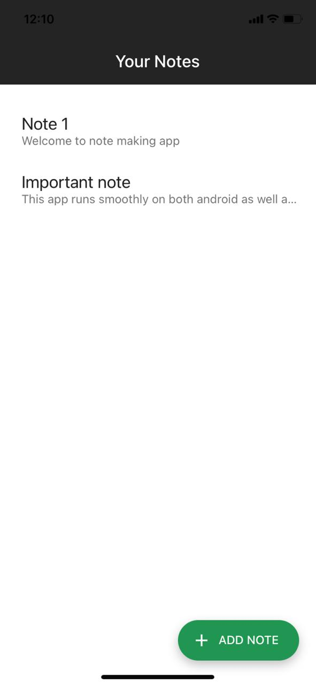

# Note Making App
This is a mobile app where user can make notes and store them in one place.
  The app can work smoothly on both android as well as iOS devices
  This app is build using 
* React-Native
* Redux
* Expo

## To run the app on your phone
* Install expo client app on phone
* Install expo-cli on system
* Run npm start and scan the QR code in the phone app

## Snapshots :
* ## Main Screen : 

* ## Add new note:
